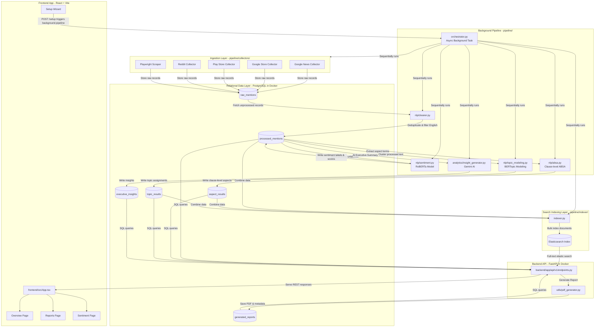

# Social Product Intelligence - Codebase & Architecture Overview

Welcome to the learning and onboarding guide for the **Social Product Intelligence** project. This document maps out the system architecture, file dependencies, runtime execution flows, and verification steps.

> **Last updated:** June 2026 — Reflects fully Dockerized backend, multi-company workspace switching, background orchestration, and integrated PDF reporting.

---

## System Architecture & Data Flow Diagram

Below is the execution and data flow diagram of the codebase. It shows how data traverses from raw sources on the internet, through clean-up and advanced NLP modeling layers, into databases and search engines, and finally onto the user dashboard or a generated PDF report.



---

## 1. Entry Point & Routing Path

Here is how execution context flows through different components of the codebase:

### A. The Setup Wizard & Background Pipeline
1. **Setup (`POST /api/v1/setup`):** The primary entry point is the Setup Wizard UI. Submitting a new company configures the workspace (saving `company_config.json` and `competitors.json`) and triggers the `setup_workspace` background thread.
2. **Orchestrator (`pipeline/orchestrator.py`):** The background thread sequentially runs all data pipelines:
   - **Collectors (`pipeline/collectors/`)**: Scrapes Reddit, Google News, Play Store.
   - **Cleaner (`pipeline/nlp/cleaner.py`)**: Normalizes text and deduplicates.
   - **Sentiment (`pipeline/nlp/sentiment.py`)**: Applies RoBERTa sentiment classification.
   - **ABSA (`pipeline/nlp/absa.py`)**: Clause-level aspect extraction.
   - **Topic Modeling (`pipeline/nlp/topic_modeling.py`)**: BERTopic clustering.
   - **Indexer (`pipeline/indexer/indexer.py`)**: Merges and indexes to Elasticsearch.
   - **Insights (`pipeline/analytics/insight_generator.py`)**: Uses Gemini AI to generate executive summaries.
3. **Report Generation (`backend/app/utils/pdf_generator.py`):** Finally, a PDF report is automatically generated at the end of the pipeline and logged to the `generated_reports` table.

### B. Backend Web API (FastAPI - Dockerized)
- **Container Name:** `social_intel_backend`
- **Primary Entry Point:** `backend/app/main.py`
- **Routing Layer:** `backend/app/api/v1/endpoints.py` handles:
  - `/setup` & `/setup/status/{workspace_id}` - Triggers and polls background pipeline.
  - `/workspace` & `/brands` - Current multi-company context.
  - `/overview`, `/sentiment`, `/aspects`, `/topics` - Analytics dashboards.
  - `/feed`, `/search` - Mentions and Elasticsearch queries.
  - `/reports`, `/reports/generate`, `/reports/download/{id}` - PDF reporting.

### C. Frontend Dashboard Application (Vite + React)
- **Primary Entry Point:** `frontend/src/main.tsx`
- **Routing & Layout:** `frontend/src/App.tsx` sets up routes:
  - `/setup` - Company onboarding wizard.
  - `/overview` - KPI scorecards.
  - `/reports` - Generated intelligence reports drawer and PDF viewer.
  - `/brand/:id` - Detailed brand dive.

---

## 2. In-Depth Component Analysis (File/State/Method)

### Database Layer (SQLAlchemy Models)
Location: `backend/app/db/models/`
- **`RawMention`**: Raw crawled data (`brand`, `source`, `content`, `rating`).
- **`ProcessedMention`**: Cleaned records (`cleaned_text`, `sentiment_label`, `sentiment_score`).
- **`AspectResult`**: Aspect sentiments (`aspect`, `sentiment_label`).
- **`TopicResult`**: Topic clusters (`topic_id`, `topic_name`).
- **`ExecutiveInsight`**: AI summaries (`top_risk`, `top_opportunity`, `executive_summary`).
- **`GeneratedReport`**: Report metadata (`report_type`, `summary`, `file_path`).

### Methods & Functions Matrix

| File / Component | Function / Method Name | Input Parameters | Return Value | Internal Logic & Purpose |
| :--- | :--- | :--- | :--- | :--- |
| `pipeline/nlp/sentiment.py` | `SentimentAnalyzer.analyze_batch()` | `texts: list[str]` | `list[dict]` | Evaluates input batch through HuggingFace RoBERTa model for sentiment labels. |
| `pipeline/nlp/absa.py` | `run_absa_pipeline()` | None | None | Finds aspects using regex keywords, applies clause-level sentiment. |
| `pipeline/indexer/indexer.py` | `index_all_data()` | None | None | Bulk indexes structural nested document models into Elasticsearch. |
| `endpoints.py` | `setup_workspace()` | `BackgroundTasks, SetupRequest` | `dict` | Async pipeline driver. Calls config setup, then kicks off data scraping & NLP pipelines. |
| `pdf_generator.py` | `generate_weekly_pdf_report()`| `db: Session` | `GeneratedReport` | Uses ReportLab to generate a multi-page PDF combining stats, insights, and feed data, handles HTML stripping for news items. |

---

## 3. Runtime Environment & Commands

### 1. Launching Infrastructure (Docker Compose)
The entire backend (FastAPI, Postgres, Elasticsearch, Airflow) runs in Docker:
```bash
# Start all containers in the background
docker-compose up -d
```
The active FastAPI backend container is `social_intel_backend`.

### 2. Frontend (React + Vite)
Run locally outside Docker for instant HMR:
```bash
cd frontend
npm install
npm run dev
```

### 3. Database Migrations
Migrations are run inside the backend container:
```bash
docker exec social_intel_backend alembic upgrade head
```

---

## 4. Operational Testing & Verification Protocol

### Success Indicators
- **Frontend Running:** `http://localhost:5173` loads without chrome-errors.
- **Backend API:** `Invoke-RestMethod "http://localhost:8000/api/v1/workspace"` returns JSON config.
- **Pipeline Completion:** `/setup/status/{workspace_id}` returns `progress: 100`.
- **Database schemas:** Check Postgres inside Docker:
  ```bash
  docker exec -it social_intel_db psql -U postgres -d social_intelligence -c "SELECT count(*) FROM processed_mentions;"
  ```
- **PDF Generation:** PDF files appear in the `generated_pdfs/` folder at the root, and `/api/v1/reports` lists new entries.

### Failure Indicators
- **`No module named 'google'`**: Backend Docker container missing dependencies. Run `docker exec social_intel_backend pip install google-genai`.
- **paraparser syntax error**: Un-stripped HTML in the PDF generator. Handled by `_strip_html()` in `pdf_generator.py`.
- **Elasticsearch ConnectionError**: Elasticsearch container `social_intel_es` is down or still booting.
