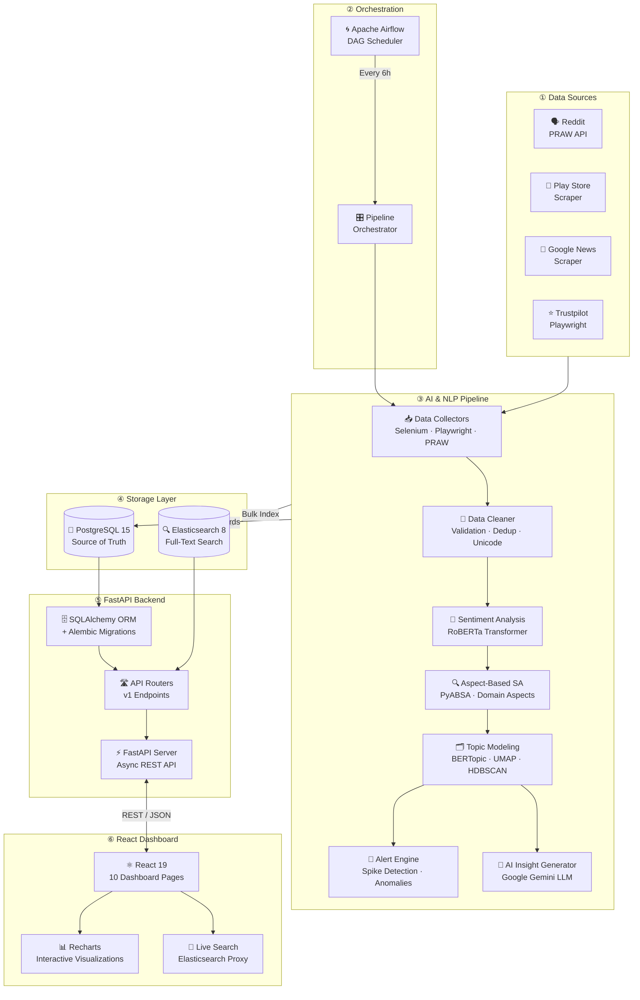

<div align="center">


<br/>

<p align="center">
  
  
  
  
  
  
  
  
  
  
</p>

<br/>

> **An end-to-end AI-powered intelligence platform** that collects social media mentions, app store reviews, and news articles, then transforms raw text into executive-grade insights using NLP, sentiment analysis, and large language models.

<br/>

[🚀 Quick Start](#-quick-start) · [🏗️ Architecture](#️-system-architecture) · [✨ Features](#-features) · [📡 API Reference](#-api-reference) · [🧠 AI Pipeline](#-ai--nlp-pipeline) · [🖥️ Dashboard](#️-dashboard-preview) · [🤝 Contributing](#-contributing)

</div>

---

## 📌 Table of Contents

- [Overview](#-overview)
- [Features](#-features)
- [System Architecture](#️-system-architecture)
- [Tech Stack](#-tech-stack)
- [AI & NLP Pipeline](#-ai--nlp-pipeline)
- [Dashboard Preview](#️-dashboard-preview)
- [Project Structure](#-project-structure)
- [Quick Start](#-quick-start)
- [Configuration](#-configuration)
- [API Reference](#-api-reference)
- [Database Schema](#-database-schema)
- [Roadmap](#-roadmap)
- [Contributing](#-contributing)

---

## 🔭 Overview

**Social Product Intelligence Platform** is a production-grade, full-stack data engineering and AI system built for modern product teams and executives. It continuously monitors the digital footprint of products and brands across:

- 🗣️ **Reddit** — organic community discussions via PRAW API
- ⭐ **Google Play Store & App Store** — user reviews and ratings
- 📰 **Google News** — real-time press coverage
- 🌐 **Trustpilot** — professional customer feedback

Data flows through an 8-stage NLP pipeline powered by **HuggingFace Transformers**, **BERTopic**, **PyABSA**, and **Google Gemini**, ultimately surfacing insights through a rich **React dashboard** with real-time visualizations.

---

## ✨ Features

<table>
<tr>
<td width="50%">

### 🧠 Intelligence
- ✅ **Sentiment Classification** — RoBERTa-powered (Positive / Neutral / Negative)
- ✅ **Aspect-Based Sentiment Analysis (ABSA)** — Pricing, UX, Support & more
- ✅ **Topic Modeling** — Auto-clustering with BERTopic + UMAP + HDBSCAN
- ✅ **Executive Insight Generation** — AI summaries via Google Gemini LLM
- ✅ **Spike & Anomaly Detection** — Alert engine for sentiment surges

</td>
<td width="50%">

### ⚙️ Engineering
- ✅ **Multi-Source Data Collection** — Reddit, Play Store, News, Trustpilot
- ✅ **Full-Text Search** — Elasticsearch-powered millisecond queries
- ✅ **Automated Scheduling** — Apache Airflow DAGs (every 6 hours)
- ✅ **PDF Report Generation** — Exportable executive reports via ReportLab
- ✅ **Docker Compose** — One-command deployment of 6 services

</td>
</tr>
<tr>
<td width="50%">

### 📊 Dashboard
- ✅ **10 Dashboard Pages** — Overview, Brands, Competitors, Alerts, Search & more
- ✅ **Interactive Charts** — Recharts time-series, sentiment distributions
- ✅ **Live Feed** — Real-time mention stream
- ✅ **Competitor Analysis** — Side-by-side brand comparison
- ✅ **Responsive UI** — Built with React 19 + Tailwind CSS v4

</td>
<td width="50%">

### 🔒 Production Ready
- ✅ **Alembic Migrations** — Version-controlled database schema
- ✅ **Pydantic Validation** — Strict request/response typing
- ✅ **SQLAlchemy ORM** — Async-capable database access
- ✅ **Health Checks** — Docker service dependency management
- ✅ **Environment-based Config** — Secure secrets management

</td>
</tr>
</table>

---

## 🏗️ System Architecture



---

## 🛠️ Tech Stack

| Layer | Technology | Purpose |
|-------|-----------|---------|
| **Data Collection** | PRAW, Playwright, BeautifulSoup, google-play-scraper | Multi-source web scraping & API |
| **NLP / AI** | HuggingFace Transformers, PyABSA, BERTopic, SentenceTransformers, UMAP | Text intelligence |
| **LLM** | Google Gemini API (`google-genai`) | Executive insight generation |
| **Scheduling** | Apache Airflow 2.x | DAG-based pipeline orchestration |
| **Backend** | FastAPI, SQLAlchemy, Alembic, Pydantic v2 | Async REST API + ORM |
| **Primary DB** | PostgreSQL 15 | Relational data storage |
| **Search** | Elasticsearch 8.11 | Full-text search index |
| **PDF Export** | ReportLab | Executive report generation |
| **Frontend** | React 19, TypeScript 6, Vite 8, Zustand | Modern SPA |
| **Charts** | Recharts 3 | Data visualization |
| **Styling** | Tailwind CSS v4 | Utility-first CSS |
| **Routing** | React Router DOM v7 | SPA navigation |
| **HTTP Client** | Axios | API communication |
| **Containerization** | Docker, Docker Compose | Service orchestration |
| **Package Manager** | uv (Python), npm (Node) | Dependency management |

---

## 🧠 AI & NLP Pipeline

The pipeline runs as a sequential, fault-tolerant 8-phase process:

```
Raw Social Text
      │
      ▼
┌─────────────────────────────────────────────────────────────┐
│ Phase 1: COLLECTION                                          │
│  ├─ reddit_collector.py    → PRAW API (subreddits, posts)    │
│  ├─ playstore_collector.py → App ratings & reviews           │
│  ├─ google_news_collector  → RSS feed + article scraping     │
│  └─ playwright_collector   → JS-rendered page scraping       │
└──────────────────────────┬──────────────────────────────────┘
                           ▼
┌─────────────────────────────────────────────────────────────┐
│ Phase 2: CLEANING (nlp/cleaner.py)                           │
│  ├─ HTML stripping & unicode normalization                    │
│  ├─ Non-English text filtering (langdetect)                  │
│  ├─ Duplicate detection (hash-based deduplication)           │
│  └─ Minimum content quality validation                        │
└──────────────────────────┬──────────────────────────────────┘
                           ▼
┌─────────────────────────────────────────────────────────────┐
│ Phase 3: SENTIMENT (nlp/sentiment.py)                        │
│  └─ cardiffnlp/twitter-roberta-base-sentiment                │
│     → Labels: POSITIVE / NEUTRAL / NEGATIVE + confidence     │
└──────────────────────────┬──────────────────────────────────┘
                           ▼
┌─────────────────────────────────────────────────────────────┐
│ Phase 4: ASPECT-BASED SENTIMENT (nlp/absa.py)                │
│  └─ PyABSA + regex pattern matching                          │
│     → Aspects: Pricing · UX · Support · Performance · Bugs   │
└──────────────────────────┬──────────────────────────────────┘
                           ▼
┌─────────────────────────────────────────────────────────────┐
│ Phase 5: TOPIC MODELING (nlp/topic_modeling.py)              │
│  └─ SentenceTransformers → UMAP → HDBSCAN → BERTopic         │
│     → Dynamic cluster detection: "Payment Failures" etc.     │
└──────────────────────────┬──────────────────────────────────┘
                           ▼
┌─────────────────────────────────────────────────────────────┐
│ Phase 6: SEARCH INDEXING (indexer/)                          │
│  └─ Elasticsearch bulk API → Full-text searchable index      │
└──────────────────────────┬──────────────────────────────────┘
                           ▼
┌─────────────────────────────────────────────────────────────┐
│ Phase 7: ALERT ENGINE (alert_engine.py)                      │
│  ├─ Negative sentiment spike detection (threshold: >50%)     │
│  ├─ Topic surge anomaly detection                             │
│  └─ Alert logs stored in PostgreSQL                          │
└──────────────────────────┬──────────────────────────────────┘
                           ▼
┌─────────────────────────────────────────────────────────────┐
│ Phase 8: AI INSIGHT GENERATION (analytics/)                  │
│  └─ Google Gemini LLM → Executive Summaries                  │
│     → Top Risks · Top Opportunities · Weekly Digest          │
└─────────────────────────────────────────────────────────────┘
```

---

## 🖥️ Dashboard Preview

| Page | Description |
|------|-------------|
| **📊 Overview** | KPI cards, sentiment trends, recent mentions |
| **🏷️ Brand Details** | Deep-dive per-brand analytics with charts |
| **⚔️ Competitor Analysis** | Side-by-side brand sentiment comparison |
| **🤖 Executive Intelligence** | LLM-generated summaries, risks & opportunities |
| **📰 Raw Feed** | Live paginated mention stream with filters |
| **🚨 Alerts** | Anomaly log with severity indicators |
| **🔎 Search** | Full-text Elasticsearch-powered search UI |
| **💬 Sentiment** | Sentiment distribution and trend analysis |
| **🗂️ Topics** | BERTopic cluster visualization |
| **📄 Reports** | PDF export with branded executive reports |

---

## 📁 Project Structure

```
Social-Intelligence/
│
├── 📂 backend/                     # FastAPI backend server
│   ├── app/
│   │   ├── api/v1/endpoints.py     # All REST API route handlers
│   │   ├── core/                   # Config, security, dependencies
│   │   ├── db/                     # SQLAlchemy models & session
│   │   └── utils/                  # Helper utilities
│   ├── alembic/                    # Database migration scripts
│   ├── Dockerfile
│   └── requirements.txt
│
├── 📂 pipeline/                    # AI & NLP data pipeline
│   ├── collectors/
│   │   ├── reddit_collector.py     # Reddit PRAW integration
│   │   ├── playstore_collector.py  # Google Play Store scraper
│   │   ├── google_news_collector.py
│   │   └── playwright_collector.py # Headless browser scraper
│   ├── nlp/
│   │   ├── cleaner.py              # Text sanitization
│   │   ├── sentiment.py            # RoBERTa sentiment model
│   │   ├── absa.py                 # Aspect-based sentiment
│   │   └── topic_modeling.py       # BERTopic clustering
│   ├── analytics/
│   │   ├── insight_generator.py    # Gemini LLM integration
│   │   └── ai_summarizer.py        # Summary generation
│   ├── indexer/                    # Elasticsearch indexing
│   ├── alert_engine.py             # Anomaly detection
│   ├── orchestrator.py             # Pipeline runner
│   ├── scheduler.py                # APScheduler config
│   └── Dockerfile.airflow
│
├── 📂 frontend/                    # React TypeScript SPA
│   ├── src/
│   │   ├── pages/                  # 10 dashboard pages
│   │   ├── components/             # Reusable UI components
│   │   ├── store/                  # Zustand state management
│   │   └── App.tsx                 # Router configuration
│   ├── package.json
│   └── vite.config.ts
│
├── 📂 dags/                        # Apache Airflow DAGs
│   └── social_intel_dag.py         # Main pipeline DAG
│
├── 📂 config/                      # Shared configuration files
├── 📂 shared/                      # Shared utilities
│
├── docker-compose.yml              # 6-service container stack
├── .env.example                    # Environment variable template
├── run_pipeline.py                 # Manual pipeline trigger
└── README.md
```

---

## 🚀 Quick Start

### Prerequisites

| Tool | Version | Install |
|------|---------|---------|
| Docker Desktop | Latest | [docker.com](https://docker.com) |
| Docker Compose | v2.x | Bundled with Docker Desktop |
| Git | Latest | [git-scm.com](https://git-scm.com) |
| Node.js *(frontend dev)* | 20+ | [nodejs.org](https://nodejs.org) |
| Python *(pipeline dev)* | 3.12 | [python.org](https://python.org) |

---

### Step 1 — Clone & Configure

```bash
# Clone the repository
git clone https://github.com/Sanjaykrishnank29/Social-Product-Intelligence-Platform.git
cd Social-Product-Intelligence-Platform

# Copy environment template
cp .env.example .env
```

Edit `.env` with your credentials:

```env
# Required
POSTGRES_USER=siuser
POSTGRES_PASSWORD=your_secure_password
POSTGRES_DB=socialintel_db

# Optional — enables LLM insights
GEMINI_API_KEY=your_gemini_api_key_here

# Optional — enables Reddit collection
REDDIT_CLIENT_ID=your_reddit_client_id
REDDIT_CLIENT_SECRET=your_reddit_client_secret
REDDIT_USER_AGENT=social-intelligence-bot/1.0
```

---

### Step 2 — Launch All Services

```bash
# Build and start all 6 containers
docker compose up --build -d
```

This starts:

| Service | URL | Description |
|---------|-----|-------------|
| **FastAPI Backend** | http://localhost:8001 | REST API server |
| **API Docs (Swagger)** | http://localhost:8001/docs | Interactive API docs |
| **Airflow Webserver** | http://localhost:8081 | Pipeline scheduler UI |
| **PostgreSQL** | localhost:5433 | Primary database |
| **Elasticsearch** | localhost:9201 | Search engine |

---

### Step 3 — Apply Database Migrations

```bash
# Run inside the backend container
docker compose exec backend alembic upgrade head
```

---

### Step 4 — Run the Frontend (Development)

```bash
cd frontend
npm install
npm run dev
# → http://localhost:5173
```

---

### Step 5 — Trigger the Pipeline

**Via Airflow** (Recommended):
1. Navigate to http://localhost:8081
2. Login with `admin/admin`
3. Enable and trigger the `social_intel_pipeline` DAG

**Via CLI** (Manual):
```bash
# Run the full pipeline once
python run_pipeline.py

# Or run individual collectors
cd pipeline
python -c "from collectors.reddit_collector import RedditCollector; ..."
```

---

## ⚙️ Configuration

### Environment Variables

| Variable | Required | Default | Description |
|----------|----------|---------|-------------|
| `POSTGRES_USER` | ✅ | `siuser` | PostgreSQL username |
| `POSTGRES_PASSWORD` | ✅ | — | PostgreSQL password |
| `POSTGRES_DB` | ✅ | `socialintel_db` | Database name |
| `POSTGRES_HOST` | ✅ | `db` | Database host (Docker service name) |
| `POSTGRES_PORT` | ✅ | `5432` | Database port |
| `BACKEND_PORT` | ❌ | `8001` | Host port for backend API |
| `FASTAPI_ENV` | ❌ | `development` | Environment mode |
| `GEMINI_API_KEY` | ❌ | — | Enables AI-generated summaries |
| `REDDIT_CLIENT_ID` | ❌ | — | Reddit API app client ID |
| `REDDIT_CLIENT_SECRET` | ❌ | — | Reddit API app client secret |
| `REDDIT_USER_AGENT` | ❌ | — | Reddit API user agent string |
| `SMTP_SERVER` | ❌ | — | SMTP server for email alerts |
| `SMTP_USER` | ❌ | — | SMTP username |
| `SMTP_PASSWORD` | ❌ | — | SMTP password |

### Getting API Keys

<details>
<summary>🔑 Google Gemini API Key</summary>

1. Go to [Google AI Studio](https://aistudio.google.com/app/apikey)
2. Click **Create API Key**
3. Copy key → paste into `.env` as `GEMINI_API_KEY`

</details>

<details>
<summary>🔑 Reddit API Credentials</summary>

1. Go to [reddit.com/prefs/apps](https://www.reddit.com/prefs/apps)
2. Click **Create another app** → select **script**
3. Copy `client_id` and `secret` → paste into `.env`

</details>

---

## 📡 API Reference

Base URL: `http://localhost:8001/api/v1`

Interactive docs: [http://localhost:8001/docs](http://localhost:8001/docs)

### Brands

| Method | Endpoint | Description |
|--------|----------|-------------|
| `GET` | `/brands/` | List all tracked brands |
| `GET` | `/brands/{brand}/overview` | Brand KPIs and sentiment stats |
| `GET` | `/brands/{brand}/mentions` | Paginated mention list |
| `GET` | `/brands/{brand}/trends` | Time-series sentiment trends |
| `GET` | `/brands/compare` | Side-by-side brand comparison |

### Analytics

| Method | Endpoint | Description |
|--------|----------|-------------|
| `GET` | `/topics/` | Trending topic clusters |
| `GET` | `/aspects/` | Aspect sentiment breakdown |
| `GET` | `/insights/` | AI-generated executive insights |
| `GET` | `/alerts/` | Anomaly and spike alerts |

### Search

| Method | Endpoint | Description |
|--------|----------|-------------|
| `GET` | `/search/?q={query}` | Full-text Elasticsearch search |
| `GET` | `/search/?q={query}&brand={brand}` | Brand-filtered search |

### Reports

| Method | Endpoint | Description |
|--------|----------|-------------|
| `POST` | `/reports/generate` | Generate a PDF report |
| `GET` | `/reports/download/{id}` | Download generated report |

---

## 🗄️ Database Schema

```
┌──────────────────────┐     ┌──────────────────────┐
│   raw_mentions       │     │  processed_mentions   │
├──────────────────────┤     ├──────────────────────┤
│ id (PK)              │────▶│ id (PK)               │
│ source               │     │ raw_mention_id (FK)   │
│ brand                │     │ brand                 │
│ content              │     │ clean_text            │
│ url                  │     │ post_date             │
│ post_date            │     │ sentiment_label       │
│ collected_at         │     │ sentiment_score       │
└──────────────────────┘     └──────────┬───────────┘
                                        │
              ┌─────────────────────────┼─────────────────────────┐
              ▼                         ▼                         ▼
┌─────────────────────┐  ┌──────────────────────┐  ┌─────────────────────┐
│   aspect_results    │  │    topic_results     │  │  executive_insights │
├─────────────────────┤  ├──────────────────────┤  ├─────────────────────┤
│ id (PK)             │  │ id (PK)              │  │ id (PK)             │
│ mention_id (FK)     │  │ mention_id (FK)      │  │ brand               │
│ aspect              │  │ topic_id             │  │ week_start_date     │
│ polarity            │  │ topic_name           │  │ summary             │
│ confidence          │  │ keywords             │  │ top_risks           │
└─────────────────────┘  └──────────────────────┘  │ top_opportunities   │
                                                    └─────────────────────┘

┌──────────────────────┐     ┌──────────────────────┐
│   pipeline_runs      │     │    alert_logs        │
├──────────────────────┤     ├──────────────────────┤
│ id (PK)              │     │ id (PK)              │
│ run_date             │     │ brand                │
│ status               │     │ alert_type           │
│ mentions_collected   │     │ severity             │
│ duration_seconds     │     │ message              │
│ error_message        │     │ detected_at          │
└──────────────────────┘     └──────────────────────┘
```

---

## 🗺️ Roadmap

- [x] Multi-source data collection (Reddit, Play Store, News, Trustpilot)
- [x] RoBERTa sentiment classification
- [x] Aspect-based sentiment analysis
- [x] BERTopic dynamic topic modeling
- [x] Elasticsearch full-text search
- [x] Apache Airflow DAG orchestration
- [x] Google Gemini executive insights
- [x] PDF report generation
- [x] React 19 dashboard with 10 pages
- [ ] Twitter/X API v2 integration
- [ ] Real-time WebSocket updates
- [ ] Multi-language sentiment support
- [ ] Slack / Microsoft Teams alert notifications
- [ ] Advanced competitor benchmarking
- [ ] Custom brand configuration UI
- [ ] Kubernetes deployment manifests
- [ ] Grafana + Prometheus monitoring stack

---

## 🤝 Contributing

Contributions are welcome! Here's how to get started:

```bash
# 1. Fork the repository on GitHub

# 2. Clone your fork
git clone https://github.com/YOUR-USERNAME/Social-Product-Intelligence-Platform.git

# 3. Create a feature branch
git checkout -b feature/your-feature-name

# 4. Make your changes and commit
git add .
git commit -m "feat: add your feature description"

# 5. Push and open a Pull Request
git push origin feature/your-feature-name
```

### Commit Convention

This project uses [Conventional Commits](https://www.conventionalcommits.org/):

| Prefix | Purpose |
|--------|---------|
| `feat:` | New feature |
| `fix:` | Bug fix |
| `docs:` | Documentation |
| `refactor:` | Code refactor |
| `test:` | Add tests |
| `chore:` | Maintenance |

---

## 📄 License

This project is licensed under the **MIT License** — see the [LICENSE](LICENSE) file for details.

---

## 👤 Author

<div align="center">

**Sanjay Krishnan K**

[](https://github.com/Sanjaykrishnank29)
[](https://linkedin.com/in/sanjaykrishnank29)

</div>

---

<div align="center">

**⭐ Star this repo if you found it useful!**

*Built with ❤️ using Python, FastAPI, React, and the power of AI*

</div>
