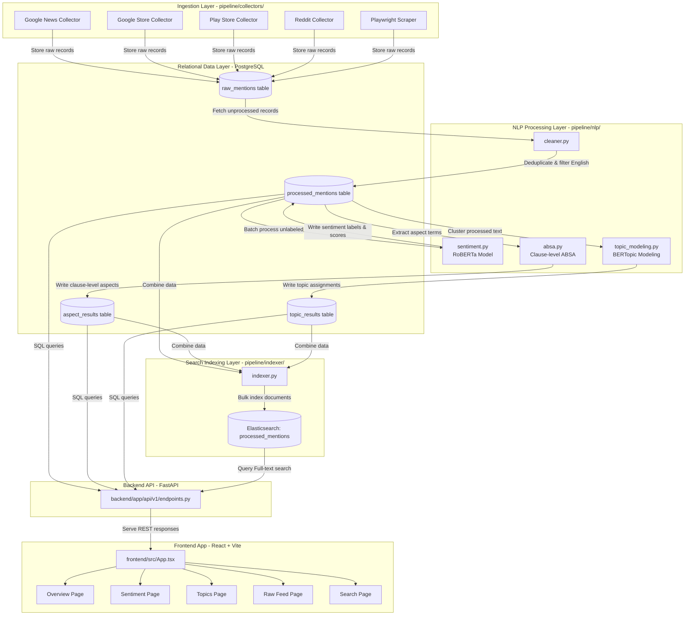

# Social Product Intelligence - Codebase & Architecture Overview

Welcome to the learning and onboarding guide for the **Social Product Intelligence** project. This document maps out the system architecture, file dependencies, runtime execution flows, and verification steps.

---

## System Architecture & Data Flow Diagram

Below is the execution and data flow diagram of the codebase. It shows how data traverses from raw sources on the internet, through clean-up and advanced NLP modeling layers, into databases and search engines, and finally onto the user dashboard.



---

## 1. Entry Point & Routing Path

Here is how execution context flows through different components of the codebase:

### A. Data Ingestion & Processing Pipeline (Triggered sequentially)
1. **Collectors:** Execution enters via standalone scripts in `pipeline/collectors/`. They crawl/scrape external APIs and push raw text directly to the PostgreSQL database table `raw_mentions`.
2. **Text Cleaner (`pipeline/nlp/cleaner.py`):** Reads unprocessed raw mentions, applies character normalizations, checks for language (English only), deduplicates texts, and stores the results in the `processed_mentions` table.
3. **Sentiment Pipeline (`pipeline/nlp/sentiment.py`):** Reads processed mentions lacking sentiment properties, loads a HuggingFace classification pipeline, and labels reviews as `positive`, `neutral`, or `negative`.
4. **Aspect-Based Sentiment Analysis (`pipeline/nlp/absa.py`):** Splits clean review text into sub-clauses, matches keywords defined in `config/aspects.json`, scores target clauses, and saves records into `aspect_results`.
5. **Topic Modeling (`pipeline/nlp/topic_modeling.py`):** Runs BERTopic clustering to group reviews into thematic topic domains and inserts labels into `topic_results`.
6. **Indexer (`pipeline/indexer/indexer.py`):** Merges processed reviews with aspect/topic results, and bulk indexes them into Elasticsearch.

### B. Backend Web API (FastAPI)
- **Primary Entry Point:** [backend/app/main.py](file:///c:/Users/DELL/Documents/Project/Social-Intelligence/backend/app/main.py)
- **Routing Layer:** All core business routing is delegated to [backend/app/api/v1/endpoints.py](file:///c:/Users/DELL/Documents/Project/Social-Intelligence/backend/app/api/v1/endpoints.py), which handles:
  - `/health` - Service health status check.
  - `/overview` - Summary stats of reviews volume, average rating, and sentiment splits per brand.
  - `/sentiment` - Sentiment distributions across brands.
  - `/feed` - Paginated review feed with sorting and filtering options.
  - `/compare` - Competitive analysis metrics comparisons.
  - `/aspects` - Aspect-based sentiment analysis scores.
  - `/topics` - Dynamic topic clusters and representative text samples.
  - `/search` - Full-text search querying Elasticsearch index with hit highlights.
- **Downstream Targets:** REST endpoints fetch data from PostgreSQL via SQLAlchemy database sessions (`app/db/session.py`) and Elasticsearch.

### C. Frontend Dashboard Application (Vite + React)
- **Primary Entry Point:** [frontend/src/main.tsx](file:///c:/Users/DELL/Documents/Project/Social-Intelligence/frontend/src/main.tsx)
- **Routing & Layout:** [frontend/src/App.tsx](file:///c:/Users/DELL/Documents/Project/Social-Intelligence/frontend/src/App.tsx) sets up client-side routes via `react-router-dom` and renders pages:
  - `Overview.tsx` - High-level metrics charts.
  - `Sentiment.tsx` - Sentiment comparison widgets.
  - `Topics.tsx` - Interrogates clustered topic themes.
  - `RawFeed.tsx` - Chronological feed of brand mentions.
  - `Search.tsx` - Elasticsearch search interface.

---

## 2. In-Depth Component Analysis (File/State/Method)

### Database Layer (SQLAlchemy Models)
File: [mention.py](file:///c:/Users/DELL/Documents/Project/Social-Intelligence/backend/app/db/models/mention.py)
- **`RawMention`**: Represents crawled raw data. State variables include: `brand`, `source`, `external_id`, `content`, `rating`, `author`, `post_date`.
- **`ProcessedMention`**: Cleaned, verified English reviews. Contains fields like: `cleaned_text`, `language`, `sentiment_label`, `sentiment_score`.
- **`AspectResult`**: Aspect sentiments linked to processed mentions. Fields: `aspect`, `sentiment_label`, `sentiment_score`.
- **`TopicResult`**: Topic clustering mapping. Fields: `topic_id`, `topic_name`.

### Methods & Functions Matrix (Core Pipelines & API Endpoints)

| File / Component | Function / Method Name | Input Parameters | Return Value | Internal Logic & Purpose |
| :--- | :--- | :--- | :--- | :--- |
| `pipeline/nlp/cleaner.py` | `clean_text()` | `text: str` | `str` | Lowercases text, strips URLs, removes emojis, and replaces double spaces. |
| `pipeline/nlp/cleaner.py` | `detect_language()` | `text: str` | `str` | Checks language code using `langdetect` (defaults to `'en'` for short inputs). |
| `pipeline/nlp/cleaner.py` | `process_raw_mentions()` | None | None | Query raw records, cleans/filters, checks duplicates, and commits to `ProcessedMention` table. |
| `pipeline/nlp/sentiment.py` | `SentimentAnalyzer.analyze_batch()` | `texts: list[str]` | `list[dict]` | Evaluates input texts batch through RoBERTa tokenizer and classification model to return labels and probability scores. |
| `pipeline/nlp/absa.py` | `split_clauses()` | `text: str` | `list[str]` | Splits sentences by punctuation and contrastive conjunctions (e.g. *but*, *however*, *and*). |
| `pipeline/nlp/absa.py` | `run_absa_pipeline()` | None | None | Finds aspects using regex keywords, applies clause-level sentiment analysis, and commits `AspectResult`. |
| `pipeline/nlp/topic_modeling.py` | `generate_topic_name()` | `words: list[str]` | `str` | Translates BERTopic word lists into human-readable domain themes (e.g., "Refund & Payment Issues"). |
| `pipeline/indexer/indexer.py` | `index_all_data()` | None | None | Fetches all processed data, joins tables, writes structural nested document models, and updates Elasticsearch index. |
| `backend/app/api/v1/endpoints.py` | `search_reviews()` | `q: str, brand: str, sentiment: str, source: str, skip: int, limit: int` | `dict` | Constructs a fuzzy, filtered bool query with highlight tags and executes it on the Elasticsearch cluster. |

---

## 3. Runtime Environment & Commands

### Prerequisites
1. **Docker Compose:** Spin up PostgreSQL (port 5432) and Elasticsearch (port 9200) containers.
2. **Python Environment:** Ensure Python 3.11+ is activated with required pipeline and backend packages installed.
3. **Node.js Environment:** Node.js 18+ to build and run Vite client.

### Execution Commands

#### 1. Launching Services (Infrastructure)
Run from the project root:
```bash
# Start Postgres and Elasticsearch containers in the background
docker-compose up -d
```

#### 2. Running Backend (FastAPI API Server)
From the `/backend` directory:
```bash
# Install backend requirements
pip install -r requirements.txt

# Run migrations to set up the DB schema
alembic upgrade head

# Start local FastAPI development server (auto-reloads on edits)
uvicorn app.main:app --host 127.0.0.1 --port 8000 --reload
```

#### 3. Running Frontend (React + Vite)
From the `/frontend` directory:
```bash
# Install node dependencies
npm install

# Run the local frontend dev server
npm run dev
```

#### 4. Running the Pipelines (Sequential Processing)
From the workspace root, execute pipeline components to collect and parse inputs:
```bash
# Ingest raw data via a collector (example: Play Store reviews)
python pipeline/collectors/playstore_collector.py

# Run cleaning module to extract clean English reviews
python pipeline/nlp/cleaner.py

# Run RoBERTa Sentiment Classification
python pipeline/nlp/sentiment.py

# Extract Aspect-based reviews (ABSA)
python pipeline/nlp/absa.py

# Perform BERTopic clustering
python pipeline/nlp/topic_modeling.py

# Bulk Index processed reviews into Elasticsearch
python pipeline/indexer/indexer.py
```

---

## 4. Operational Testing & Verification Protocol

Follow this protocol to verify if the components are functioning correctly after modification:

### Success Indicators (How to confirm operations are healthy)
- **FastAPI status:** Hitting `http://127.0.0.1:8000/api/v1/health` returns:
  ```json
  {"status": "healthy"}
  ```
- **Database schemas:** Check Postgres tables directly:
  ```sql
  SELECT count(*) FROM raw_mentions;
  SELECT count(*) FROM processed_mentions;
  ```
- **Elasticsearch state:** Confirm the index mapping contains records:
  ```bash
  curl -X GET "http://localhost:9200/processed_mentions/_count"
  ```
  *(Expected response contains a count of documents > 0).*

### Failure Indicators (What to look out for)
- **Elasticsearch exceptions:** In the FastAPI logs:
  `Elasticsearch search failed: ConnectionError` (Elasticsearch is offline or credentials/ports are misconfigured).
- **Sentiment batch memory crashes:** In the pipeline log:
  `OutOfMemoryError` or `CUDA error` (indicates that GPU/CPU ran out of memory, reduce `batch_size` in `sentiment.py`).
- **Alembic migration gaps:**
  `sqlalchemy.exc.ProgrammingError: (psycopg2.errors.UndefinedTable) relation "aspect_results" does not exist` (run `alembic upgrade head` to resolve).
